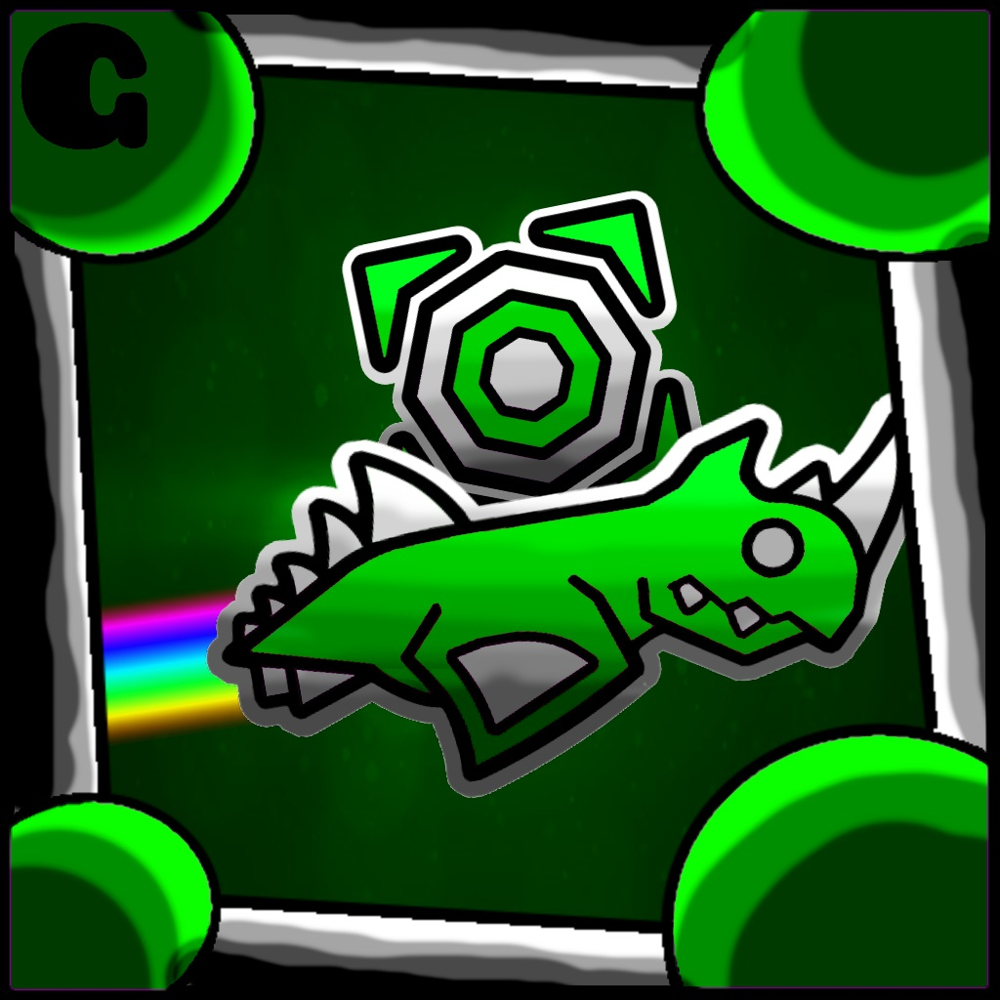

# Cryptic
Official Cryptic Mod for Geometry Dash

<p align="center">
  
  
  
</p>

<p align="center">
  
</p>

---

## 🌌 About Cryptic

Cryptic is a lightweight and powerful Geometry Dash mod focused on clean enhancements, useful utilities, and optional quality-of-life improvements — without destroying the vanilla experience.

Built with performance, simplicity, and stability in mind.

---

## ✨ Features

- Instant Complete (toggleable)
- Unlock All Icons / Colors / Cosmetics
- Unlock Official Levels
- No-Clip support
- Clean in-game settings menu
- Lightweight and optimized

More features coming soon.

---

## 🎯 Philosophy

Cryptic is designed to:

- Enhance — not overload  
- Stay fast and stable  
- Keep the core gameplay feel intact  
- Provide clean and optional utilities  

No unnecessary bloat. No messy UI. Just tools that make sense.

---

## 🚀 Installation

1. Install Geode.
2. Download the latest Cryptic release.
3. Place it in your Geode mods folder.
4. Launch Geometry Dash.
5. Configure Cryptic in the in-game mod menu.

---

## 🛠 Build Instructions

Make sure you have the Geode CLI installed.

```sh
geode build
```

---

## 📚 Resources

- Geode SDK Documentation  
  https://docs.geode-sdk.org/

- Geode SDK Source  
  https://github.com/geode-sdk/geode/

- Geode CLI  
  https://github.com/geode-sdk/cli

- Bindings  
  https://github.com/geode-sdk/bindings/

- Dev Tools  
  https://github.com/geode-sdk/DevTools

---

## 👤 Developer

Created by **[KiwiZariu](https://github.com/kiwizariudev)**

Project Repository:  
https://github.com/kiwizariudev/cryptic